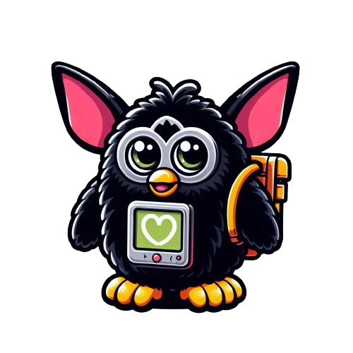
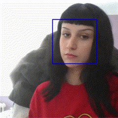
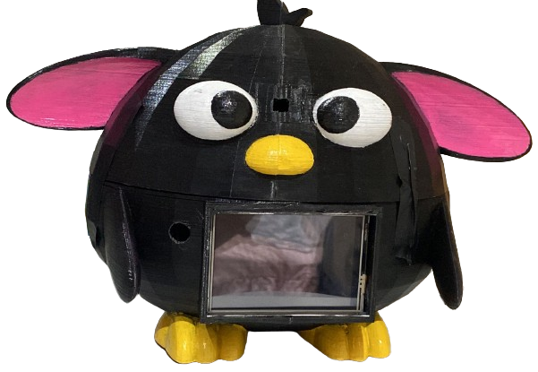

  
# Gibbly  
<h3>Gibbly is an adorable and functional robot designed to facilitate communication between deaf-mute individuals and those who can speak. Inspired by the popular appearance of the classic Furby, this device merges modern technology with a charming and friendly design. </h3>

## Table of Contents
   * [Hardware Requirements](#hardware-requirements)
   * [Software Requirements](#software-requirements)
   * [Documentation](#documentation)
   * [How To Use](#how-to-use)
   * [Hardware Architecture](#hardware-architecture)
   * [Algorithms](#algorithms)
   * [Images](#images)
   * [3D](#3d)
   * [Video](#video)
   * [References](#references)
   * [Authors](#authors)

## Hardware Requirements
- Raspberry Pi 3b
- Raspberry Cam
- Raspberry Microphone
- 1 Servo motor
- 1 Servo controller
- 1 Battery
- 1 Step-down

## Software Requirements
For development:
- Fully developed in [Python](https://www.python.org/)
  
For running the code:
- Flask
- OpenCV
- Pyttsx3
- SpeechRecognition
- MatPlotLib
- Pillow
- Adafruit
- Numpy
- Tkinter
- Sklearn
- Picamera2
- Mediapipe
- Unidecode

## Documentation
Software:
- [Flask](https://flask.palletsprojects.com/en/3.0.x/)
- [Opencv](https://opencv.org/)
- [pytts3x](https://pypi.org/project/pyttsx3/)
- [SpeechRecognition](https://pypi.org/project/SpeechRecognition/)
- [Matplotlib](https://matplotlib.org/)
- [Pillow](https://pypi.org/project/pillow/)
- [Adafruit](./Hardware/Pantalla.jpg)
- [Numpy](https://numpy.org/doc/stable/user/index.html#user)
- [Tkinter](https://docs.python.org/3/library/tk.html)
- [Scikit-Learn](https://scikit-learn.org/0.21/documentation.html)
- [Picamera2](https://datasheets.raspberrypi.com/camera/picamera2-manual.pdf)
- [Mediapipe](https://ai.google.dev/edge/mediapipe/solutions/guide?hl=es-419)
- [Unidecode](https://pypi.org/project/Unidecode/)

Hardware:
- [Raspberry Pi](https://www.raspberrypi.com/documentation/)
- [Cam](./Hardware/CAMMODV2.pdf)
- [Mic](./Hardware/Micro.pdf)
- [Servo Datasheet](./Hardware/sg90_datasheet.pdf)
- [Servo Controller](./Hardware/PCA9685.pdf)
- [Step-down](./Hardware/Step-down.pdf)

## How to use
1. Clone this repository:
   ```terminal
   git clone https://github.com/PauMarti1/Gibbly.git
   ```
2. Install the dependencies:
   ```terminal
    pip install -r requirements/requirements.txt
    ```
3. Execute "server.py" and "main.py". Use the Gibbly App to test it or uncomment the code to use it with the keyboard.

## Project Modules
<div align="center">
  
</div>

## Hardware Architecture
<div align="center">
  
</div>

## Algorithms
Two algorithms are used: one responsible for detecting American Sign Language (ASL) and another responsible for Face Tracking.

The first one was developed as part of the "Computer Vision" course project. There, we trained a model that we saved and loaded using "Pickle," which is capable of detecting ASL. Its functionality is as follows: when a letter is shown on camera for more than 3 seconds, it will be detected and written in the box. If the hand is not detected for a few seconds, a space is written, and if no hand is detected for more than 15 seconds, the conversation moves to the next part.

<div align="center">
  
</div>

On the other hand, for Face Tracking, we use "haarcascade_frontalface_default.xml" provided by OpenCV. The "haarcascade_frontalface_default.xml" is a pre-trained classifier provided by OpenCV for detecting frontal faces in an image. It uses the Haar feature-based cascade classifier technique to identify objects (in this case, faces). The algorithm works by sliding a window over the image and checking for the presence of features that match a face.

<div align="center">
  
</div>

## Images
<div align="center">
  
</div>

## 3D
You can find a folder named [3D](./3D) with all the 3D modeling. Here is the main 3D model:
<div align="center">
  
</div>

## Video
(Video del funcionament)

## References
- [Text to speech module](https://pypi.org/project/pyttsx3/)
- [Speech to text module](https://pypi.org/project/SpeechRecognition/)
- [Face tracking](https://www.instructables.com/Pan-Tilt-face-tracking-with-the-raspberry-pi/)
- [OpenCV HaarCascades](https://github.com/kipr/opencv/tree/master/data/haarcascades)

## Authors
- Nerea Garrido
- Pau Martí
- Carlos Molina
- Naim Moltrasio
