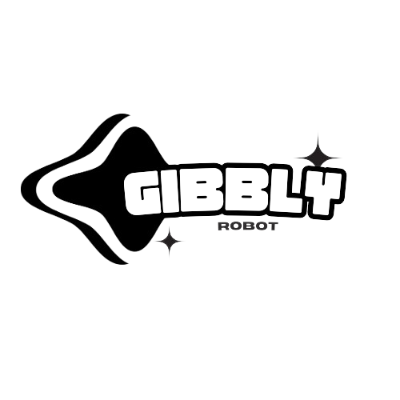
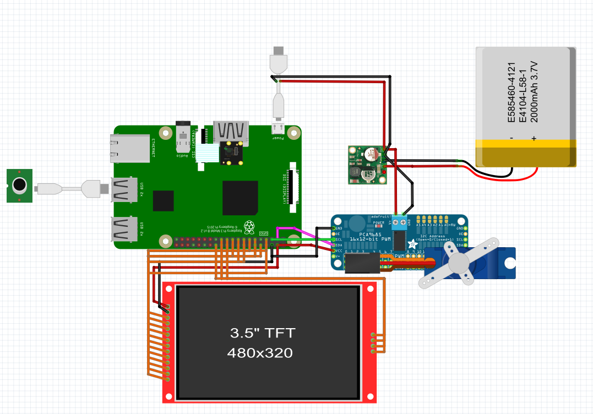

  

<h3>Gibbly is an adorable and functional robot designed to facilitate communication between deaf-mute individuals and those who can speak. Inspired by the popular appearance of the classic Furby, this device merges modern technology with a charming and friendly design. </h3>

## Hardware Requirements
- Raspberry Pi 3b
- Raspberry Cam
- Raspberry Microphone
- 1 Servo motor
- 1 Servo controller
- 1 Battery
- 1 Step-down

## Software Requirements
Fully developed in [Python](https://www.python.org/)

Dependencies:
- Flask==2.3.2
- opencv-python==4.8.0.74
- pyttsx3==2.90
- SpeechRecognition==3.8.1
- matplotlib==3.7.1
- Pillow==9.4.0
- Adafruit

## Documentation
- [Flask](https://flask.palletsprojects.com/en/3.0.x/)
- [Opencv](https://opencv.org/)
- [pytts3x](https://pypi.org/project/pyttsx3/)
- [SpeechRecognition](https://pypi.org/project/SpeechRecognition/)
- [Matplotlib](https://matplotlib.org/)
- [Pillow](https://pypi.org/project/pillow/)
- [Adafruit](./Hardware/Pantalla.jpg)

- [Raspberry Pi](https://www.raspberrypi.com/documentation/)
- [Cam](./Hardware/CAMMODV2.pdf)
- [Mic](./Hardware/Micro.pdf)
- [Servo Datasheet](./Hardware/sg90_datasheet.pdf)
- [Servo Controller](./Hardware/PCA9685.pdf)
- [Step-down](./Hardware/Step-down.pdf)

## Project Modules

  

## Hardware Architecture

  

## Images
(Foto robot per fora i per dins)

## 3D
You can find a folder named 3D in which you can see our 3d modelling of our robot. Also there are some necessary pieces for the head movement.
[3D](./3D)

## Video
(Video del funcionament)

## References
- [Text to speech module](https://platform.openai.com/docs/guides/text-to-speech)
- [Speech to text module](https://platform.openai.com/docs/guides/speech-to-text/quickstart)
- [Face tracking](https://www.instructables.com/Pan-Tilt-face-tracking-with-the-raspberry-pi/)

## Authors
- Nerea Garrido
- Carlos Molina
- Naim Moltrasio
- Pau Martí
